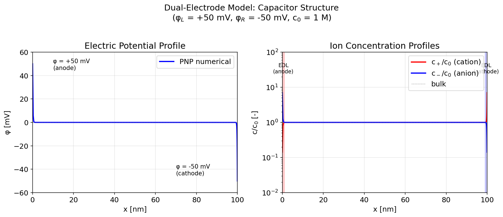
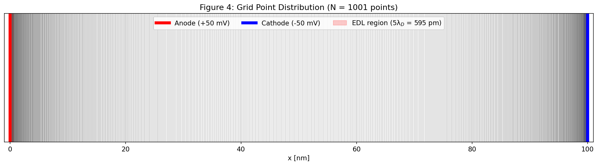
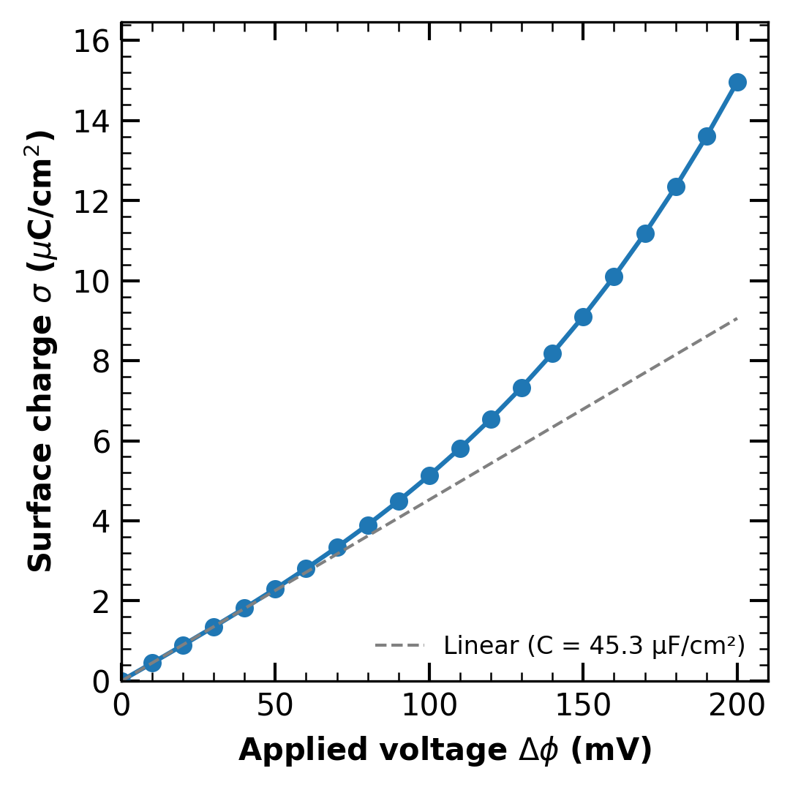
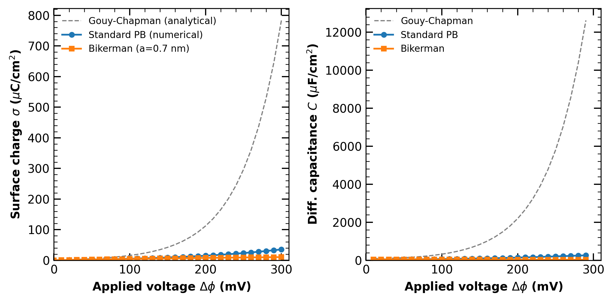
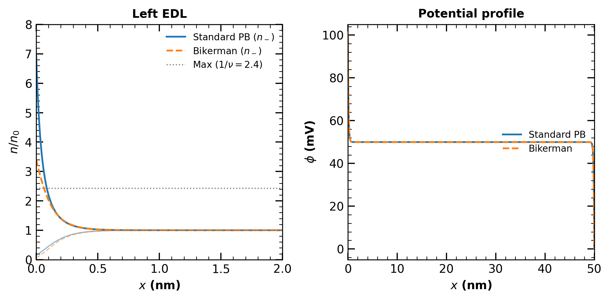

# 1D Poisson-Nernst-Planck Solver

イオン液体中の電気二重層（EDL）をシミュレーションするための C++ 数値解析ソルバー。

## 概要

Poisson-Nernst-Planck (PNP) 方程式を用いて、帯電した界面近傍のイオン分布と電位分布を計算する1次元ソルバー。

### 主な機能

- **定常解析**: Newton-Raphson法による Poisson-Boltzmann 方程式の求解
- **過渡解析**: E-field 定式化 + Newton-Raphson（⚠️ 機能するが低速）
- **Bikerman モデル**: 有限イオンサイズによる立体効果
- **両電極モデル**: キャパシタ構造（closed system）のシミュレーション
- **非一様グリッド**: 界面付近にグリッドを集中配置

> 📖 **詳細ドキュメント**: [docs/README_full.md](docs/README_full.md) | [理論](docs/theory.md) | [検証結果](docs/validation.md)

## クイックスタート

```bash
# ビルド
make

# 基本実行（定常解析）
./build/pnp_solver --phi0 100 --c0 1.0

# 両電極モデル（キャパシタ）
./build/pnp_solver --phi0 100 --phi-right 0 --closed-system --dual-electrode

# Bikerman モデル
./build/pnp_solver --phi0 100 --model bikerman --ion-size 0.7

# 結果の可視化
python3 scripts/plot_results.py
python3 scripts/plot_dual_electrode.py
```

## 計算結果

### 電気二重層構造

<div align="center">


*電位分布、濃度分布、空間電荷密度（c₀ = 1 M, φ₀ = 100 mV, L = 50 nm）*
</div>

### 両電極モデル（キャパシタ）

<div align="center">


*両電極構造における EDL（φ_L = 100 mV, φ_R = 0 mV, φ_bulk = 50 mV）*
</div>

| 位置 | 電位 [mV] | c₊/c₀ | c₋/c₀ |
|:-----|----------:|------:|------:|
| 左端 (x = 0) | 100.0 | 0.14 | 7.03 |
| バルク (x = L/2) | 50.0 | 1.00 | 1.00 |
| 右端 (x = L) | 0.0 | 7.03 | 0.14 |

**物理的解釈**: 左電極（+100 mV）ではアニオンが蓄積（c₋/c₀ ≈ 7）、右電極（0 mV）ではカチオンが蓄積。バルクでは電気的中性が保たれる。濃度比 exp(±50 mV / 25.7 mV) ≈ 7.0 は Boltzmann 分布と一致。

### 格子点位置の可視化

<div align="center">


*両電極近傍の EDL 領域（5λD）にそれぞれ集中配置し、バルク領域は粗い格子で効率化。*
</div>

### 電圧-電荷特性

<div align="center">


*印加電圧と表面電荷密度の関係。低電圧で線形、高電圧で sinh 的増加。*
</div>

### Standard PB vs Bikerman モデル

<div align="center">


*Standard PB（= Gouy-Chapman 解析解）は sinh 的に増加、Bikerman（有限イオンサイズ）は飽和。*
</div>

| 電圧 [mV] | Standard PB [μC/cm²] | Gouy-Chapman [μC/cm²] | Bikerman [μC/cm²] |
|:---------:|:--------------------:|:---------------------:|:-----------------:|
| 100 | 5.20 | 5.21 | 4.32 |
| 200 | 15.68 | 15.74 | 7.78 |
| 300 | 41.43 | 42.39 | 10.44 |

*N = 4001 で計算。Standard PB と Gouy-Chapman の誤差は 300 mV でも 2.3% 以内。*

### 濃度分布の比較（Standard PB vs Bikerman）

<div align="center">

</div>

**左パネル**: 左電極近傍（x = 0〜2 nm）のイオン濃度分布
- **青実線**: Standard PB のアニオン濃度 n₋/n₀（表面で ≈ 7.0）
- **橙破線**: Bikerman のアニオン濃度 n₋/n₀（表面で ≈ 3.4）
- **薄い線**: カチオン濃度 n₊/n₀（表面で ≈ 0.14）
- **灰点線**: Bikerman 理論的最大値 c_max/c₀ = 2/ν ≈ 4.8（ψ→∞ の漸近値）

**右パネル**: 電位分布 φ(x)。両モデルでほぼ同一（バルク電位 = 50 mV）。

**物理的解釈**: Standard PB では Boltzmann 分布 exp(eφ/k_BT) に従い濃度が発散しうるが、Bikerman モデルでは有限イオンサイズ（a = 0.7 nm）による crowding 効果で濃度が制限される。

### 格子収束性（Standard PB）

<div align="center">

</div>

**参照解**: Gouy-Chapman解析解 $\tanh(\psi/4) = \tanh(\psi_0/4) \exp(-x/\lambda_D)$

**L2誤差**: $\|e\|_{L_2} = \sqrt{\int_0^L (\phi^{\text{num}} - \phi^{\text{GC}})^2 dx / L}$

**結果**: 2次精度の収束を確認（平均収束次数: 2.00）

### 格子収束性（Bikerman）

<div align="center">

</div>

**(a) 表面電荷誤差**: Bikerman解析解 $\sigma = \sqrt{2\varepsilon k_B T c_0 N_A} \cdot \frac{2}{\sqrt{\nu}} \sinh^{-1}\left(\sqrt{\nu}\sinh\frac{\psi_0}{2}\right)$ との相対誤差 [%]

**(b) 電位プロファイルL2誤差**: Richardson外挿法（最密グリッド N=3201 を参照解として使用）

$$\|e\|_{L_2} = \sqrt{\frac{1}{N}\sum_i (\phi_i^{\text{num}} - \phi_i^{\text{ref}})^2}$$

**結果**: 両指標とも2次精度（平均収束次数: σ ≈ 1.84, L2 ≈ 2.06）

### 過渡解析（EDL形成過程）⚠️

<div align="center">


*100 mV ステップ応答の時間発展（0〜200 ns）— 過渡ソルバは開発中*
</div>

## コマンドラインオプション

| オプション | 説明 | デフォルト |
|-----------|------|-----------|
| `--phi0 <mV>` | 左電極電位 | 100 |
| `--phi-right <mV>` | 右電極電位 | 0 |
| `--c0 <mol/L>` | バルク濃度 | 1.0 |
| `--eps <value>` | 比誘電率 | 12 |
| `--L <nm>` | 計算領域長 | 50 |
| `--N <points>` | グリッド点数 | 1001 |
| `--stretch <factor>` | グリッドストレッチング | 3.0 |
| `--closed-system` | 両端ゼロフラックス境界条件 | off |
| `--dual-electrode` | 両電極用対称グリッド | off |
| `--model <type>` | standard / bikerman | standard |
| `--ion-size <nm>` | イオン直径（Bikerman用） | 0.7 |
| `--output <file>` | 出力ファイル名 | results/pnp_results.dat |

## 出力データ

ソルバーは以下の情報を出力：

```
# Surface charge density [uC/cm^2]:
#   Left electrode:  5.12994
#   Right electrode: -5.12994
# Capacitance [uF/cm^2]:
#   Left EDL:  102.599
#   Right EDL: 102.599
#   Total (series): 51.2994
```

データファイルのカラム:
1. x [nm]
2. x/λD [-]
3. φ [mV]
4. φ/(kT/e) [-]
5. c+ [mol/m³]
6. c- [mol/m³]
7. c+/c₀ [-]
8. c-/c₀ [-]
9. ρ [C/m³]
10. φ_GC [mV]
11. Δx [nm]

## ファイル構成

```
pnp/
├── include/pnp_solver.hpp    # クラス定義
├── src/
│   ├── pnp_solver.cpp        # ソルバー実装
│   └── main.cpp              # CLI エントリーポイント
├── scripts/
│   ├── plot_results.py       # 基本結果プロット
│   ├── plot_dual_electrode.py # 両電極モデルプロット
│   ├── plot_voltage_charge.py # 電圧-電荷特性
│   ├── plot_voltage_charge_comparison.py # PB vs Bikerman
│   ├── plot_convergence.py   # 収束性プロット
│   ├── run_convergence.sh    # 収束性テスト
│   └── create_animation.py   # GIFアニメーション
├── styles/plot_style.py      # プロットスタイル定義
├── docs/                     # 詳細ドキュメント
│   ├── theory.md            # 理論・数値解法
│   └── validation.md        # 検証結果
├── results/                  # 出力データ・図
├── CLAUDE.md                # 開発ガイドライン
└── README.md
```

## 理論背景

詳細な数学的導出は [docs/theory.md](docs/theory.md) を参照。検証結果は [docs/validation.md](docs/validation.md) を参照。

### 支配方程式

| 方程式 | 数式 | 役割 |
|--------|------|------|
| **Poisson** | $\nabla^2 \phi = -\frac{e}{\varepsilon}(z_+ c_+ + z_- c_-)$ | 電位分布 |
| **Nernst-Planck** | $\mathbf{J}_i = -D_i \left( \nabla c_i + \frac{z_i e c_i}{k_B T} \nabla \phi \right)$ | イオン輸送 |
| **連続の式** | $\frac{\partial c_i}{\partial t} = -\nabla \cdot \mathbf{J}_i$ | 質量保存 |

### 解析解（検証用）

| モデル | 支配方程式 | 解析解 |
|--------|-----------|--------|
| **Standard PB** | $\frac{d^2 \phi}{d x^2} = \frac{2 e N_A c_0}{\varepsilon} \sinh\left( \frac{e \phi}{k_B T} \right)$ | Gouy-Chapman: $\tanh\left(\frac{\psi}{4}\right) = \tanh\left(\frac{\psi_0}{4}\right) e^{-x/\lambda_D}$ |
| **Bikerman** | 同上 + 立体効果 | 表面電荷: $\sigma = \sqrt{2\varepsilon k_B T c_0 N_A} \cdot \frac{2}{\sqrt{\nu}} \sinh^{-1}\left(\sqrt{\nu} \sinh\frac{\psi_0}{2}\right)$ |

**Standard PB の導出**: 定常状態（∂c/∂t = 0）かつゼロフラックス（J = 0）条件下で、Nernst-Planck 方程式を積分すると Boltzmann 分布 $c_\pm = c_0 \exp(\mp e\phi/k_B T)$ が得られる。これを Poisson 方程式に代入して PB 方程式を得る。

### 数値解法

| 解法 | 離散化 | 適用 |
|------|--------|------|
| **定常（Newton-Raphson）** | 2階中心差分、非一様グリッド | Poisson-Boltzmann 方程式 |
| **過渡（E-field）** | 後退 Euler + 算術平均フラックス | PNP 連立方程式 |

**空間離散化**（非一様グリッド）:
$$\frac{d^2 \phi}{d x^2} \approx \frac{2}{h_i + h_{i+1}} \left( \frac{\phi_{i+1} - \phi_i}{h_{i+1}} - \frac{\phi_i - \phi_{i-1}}{h_i} \right)$$

**Newton-Raphson 反復**: 残差 $R_i = \frac{d^2\phi}{dx^2} - \frac{2eN_Ac_0}{\varepsilon}\sinh(\psi_i)$ をゼロにする $\delta\phi$ を求め、$\phi \leftarrow \phi + \omega \cdot \delta\phi$ で更新（$\omega$ は緩和係数）。

### 特性スケール

| 量 | 定義 | 1M での値 |
|---|---|---|
| Debye 長 λD | $\sqrt{\varepsilon k_B T / 2e^2 c_0 N_A}$ | 0.12 nm |
| 熱電圧 φT | $k_B T / e$ | 25.7 mV |

### Bikerman モデル（有限イオンサイズ）

修正 Boltzmann 分布（充填率 $\nu = 2a^3 c_0 N_A$）:

$$c_\pm = \frac{c_0 \exp(\mp \psi)}{1 - \nu + \nu \cosh(\psi)}$$

高濃度で crowding 効果により $c_\pm \leq c_{\max} = 1/(a^3 N_A)$ に制限される。

## 参考文献

1. Newman & Thomas-Alyea (2004). *Electrochemical Systems* (3rd ed.)
2. Bazant et al. (2009). *Adv. Colloid Interface Sci.* 152, 48-88.
3. Kilic, Bazant & Ajdari (2007). *Phys. Rev. E* 75, 021502.
4. Kornyshev (2007). *J. Phys. Chem. B* 111, 5545-5557.

## ライセンス

BSD 3-Clause License

自由な利用・改変・再配布が可能（商用含む）。著作権表示の保持が必要。無保証。
