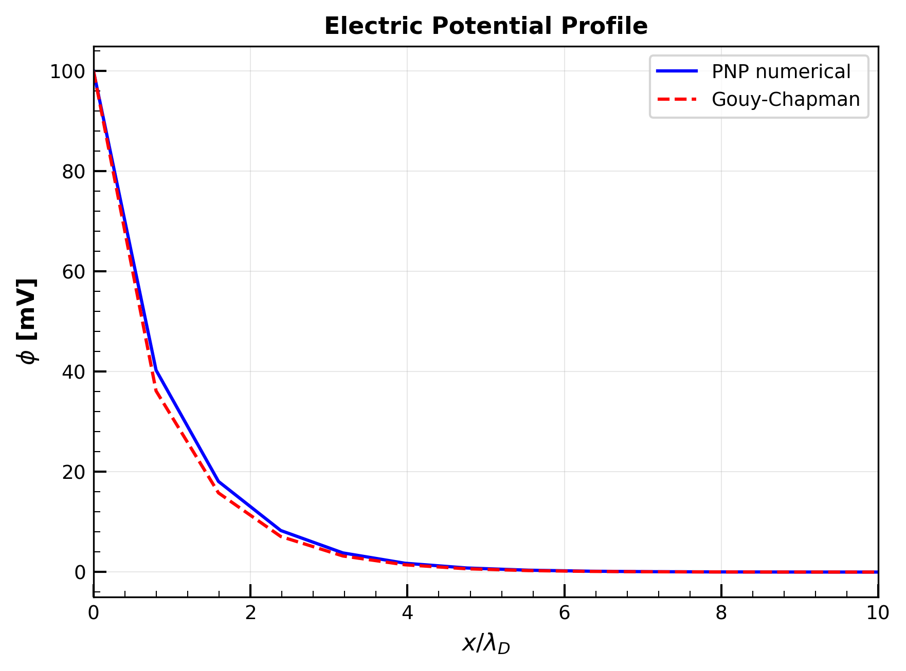
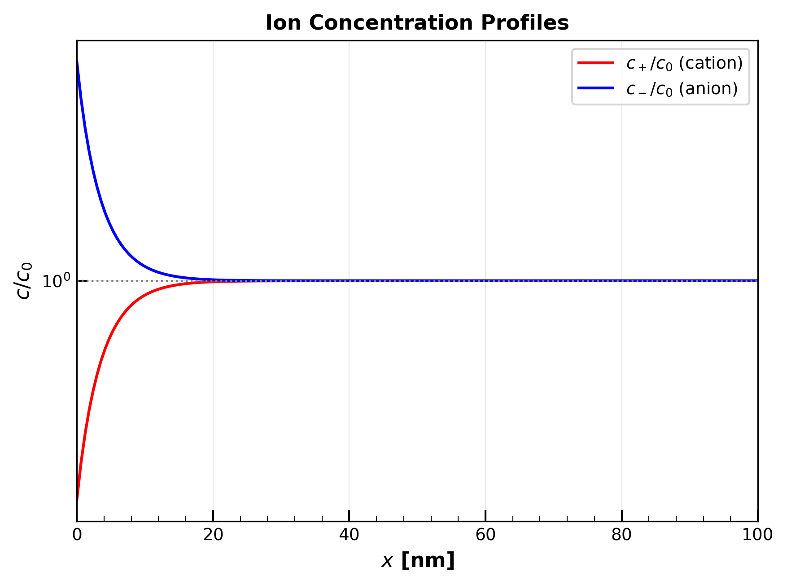

# 1次元 Poisson-Nernst-Planck ソルバー

イオン液体中の電気二重層（EDL: Electric Double Layer）をシミュレーションするための C++ 数値解析ライブラリ。

## 概要

本プロジェクトは、Poisson-Nernst-Planck (PNP) 方程式を用いて、帯電した界面近傍のイオン分布と電位分布を計算する1次元ソルバーを実装しています。

### 主な機能

- **Newton-Raphson ソルバー**: 非線形 Poisson-Boltzmann 方程式の高速求解
- **非一様グリッド**: 界面付近にグリッドを集中配置して解像度を向上
- **Gouy-Chapman 解析解**: 検証用の理論解との比較
- **Bikerman モデル**: 有限イオンサイズによる立体効果（steric effects）
- **過渡解析ソルバー**: 陰的 Scharfetter-Gummel スキームによる時間発展計算
- **誤差解析**: L2/L∞ ノルムによる精度評価

## 支配方程式

### Poisson-Nernst-Planck 方程式

電解質中のイオン輸送は以下の連立方程式で記述される：

**Poisson 方程式**（静電ポテンシャル）:

$$\nabla^2 \phi = -\frac{\rho}{\varepsilon} = -\frac{e}{\varepsilon}(z_+ c_+ + z_- c_-)$$

ここで：
- φ : 電位 [V]
- ρ : 電荷密度 [C/m³]
- ε = εᵣε₀ : 誘電率 [F/m]
- e = 1.602 × 10⁻¹⁹ C : 素電荷
- z± : イオン価数
- c± : イオン濃度 [mol/m³]

**Nernst-Planck 方程式**（イオンフラックス）:

$$\mathbf{J}_i = -D_i \left( \nabla c_i + \frac{z_i e c_i}{k_B T} \nabla \phi \right)$$

ここで：
- **J**ᵢ : イオン種 i のフラックス [mol/(m²·s)]
- Dᵢ : 拡散係数 [m²/s]
- kB = 1.381 × 10⁻²³ J/K : Boltzmann 定数
- T : 温度 [K]

**連続の式**:

$$\frac{\partial c_i}{\partial t} = -\nabla \cdot \mathbf{J}_i$$

### 1次元定式化

x 方向のみを考慮した1次元系では：

$$\frac{d^2 \phi}{d x^2} = -\frac{e}{\varepsilon}(z_+ c_+ + z_- c_-)$$

$$\frac{\partial c_\pm}{\partial t} = D_\pm \frac{\partial}{\partial x} \left( \frac{\partial c_\pm}{\partial x} \pm \frac{e c_\pm}{k_B T} \frac{\partial \phi}{\partial x} \right)$$

### Poisson-Boltzmann 方程式の導出（PNP の定常解）

**Poisson-Boltzmann (PB) 方程式は、PNP 方程式系の定常状態解として導出される。** これは独立した方程式ではなく、PNP の特殊ケースである。

**導出の流れ**:

1. **定常状態条件**: ∂c/∂t = 0 より、連続の式から ∇·**J** = 0
2. **ゼロフラックス条件**: 阻止電極（イオンが透過しない境界）では **J** = 0
3. **Nernst-Planck 方程式にゼロフラックス条件を適用**:

$$\mathbf{J} = -D \left( \nabla c + \frac{ze c}{k_B T} \nabla \phi \right) = 0$$

これを整理すると：

$$\frac{\nabla c}{c} = -\frac{ze}{k_B T} \nabla \phi$$

4. **積分して Boltzmann 分布を得る**:

$$\ln c - \ln c_0 = -\frac{ze}{k_B T}(\phi - \phi_{\text{bulk}})$$

バルク条件（φ_bulk = 0, c = c₀）を基準として：

$$c_\pm = c_0 \exp\left( \mp \frac{e \phi}{k_B T} \right)$$

5. **Poisson 方程式に代入して PB 方程式を得る**:

$$\frac{d^2 \phi}{d x^2} = -\frac{e NA}{\varepsilon}(c_+ - c_-) = \frac{2 e NA c_0}{\varepsilon} \sinh\left( \frac{e \phi}{k_B T} \right)$$

**重要**: PB 方程式は PNP 方程式系において「定常状態」かつ「ゼロフラックス」という2つの条件が満たされたときにのみ成立する。過渡状態や電流が流れる系では、完全な PNP 方程式系を解く必要がある。

### 無次元化

**特性スケール**:

| 量 | 定義 | 物理的意味 |
|---|---|---|
| Debye 長 | λD = √(εkBT / 2e²c₀NA) | 遮蔽長さ |
| 熱電圧 | φT = kBT/e ≈ 25.7 mV (298 K) | 熱エネルギー |
| バルク濃度 | c₀ | 基準濃度 |

**無次元変数**:

$$\xi = \frac{x}{\lambda_D}, \quad \psi = \frac{\phi}{\phi_T} = \frac{e \phi}{k_B T}$$

**無次元 Poisson-Boltzmann 方程式**:

$$\frac{d^2 \psi}{d \xi^2} = \sinh(\psi)$$

### Gouy-Chapman 解析解

1:1 電解質において、表面電位 ψ₀ が与えられたときの解析解：

$$\tanh\left( \frac{\psi}{4} \right) = \tanh\left( \frac{\psi_0}{4} \right) \exp(-\xi)$$

次元量に戻すと：

$$\phi(x) = \frac{4 k_B T}{e} \tanh^{-1} \left[ \tanh\left( \frac{e \phi_0}{4 k_B T} \right) \exp\left( -\frac{x}{\lambda_D} \right) \right]$$

**導出**:

Poisson-Boltzmann 方程式を一度積分すると：

$$\left( \frac{d\psi}{d\xi} \right)^2 = 2(\cosh\psi - 1) = 4\sinh^2\left( \frac{\psi}{2} \right)$$

したがって：

$$\frac{d\psi}{d\xi} = -2\sinh\left( \frac{\psi}{2} \right)$$

（負号は電位が界面から離れるにつれ減少することを反映）

変数分離して積分：

$$\int_{\psi_0}^{\psi} \frac{d\psi'}{2\sinh(\psi'/2)} = -\int_0^{\xi} d\xi'$$

$$\ln\left| \tanh\left( \frac{\psi}{4} \right) \right| - \ln\left| \tanh\left( \frac{\psi_0}{4} \right) \right| = -\xi$$

これより Gouy-Chapman 解が得られる。

### Bikerman モデル（修正 Poisson-Boltzmann）

標準 Poisson-Boltzmann 方程式は、高電位領域でイオン濃度が非物理的に高くなる問題がある。Bikerman モデルは有限イオンサイズを考慮することでこの問題を解決する。

**修正 Boltzmann 分布**:

$$c_\pm = \frac{c_0 \exp(\mp \psi)}{g(\psi)}$$

**混雑関数（crowding function）**:

$$g(\psi) = 1 - \nu + \nu \cosh(\psi)$$

**充填率（packing fraction）**:

$$\nu = 2 a^3 c_0 NA$$

ここで *a* はイオン直径（イオン液体では典型的に 0.5〜1.0 nm）。

**修正 Poisson-Boltzmann 方程式**:

$$\frac{d^2 \psi}{d \xi^2} = \frac{\sinh(\psi)}{g(\psi)}$$

**物理的解釈**:

- 低電位（|ψ| ≪ 1）: g(ψ) ≈ 1 となり標準 PB に帰着
- 高電位: g(ψ) により最大濃度が c₀/ν 程度に制限
- 非物理的な濃度 c > 1/(a³NA) を防止

**参考文献**: Kilic, Bazant & Ajdari, *Phys. Rev. E* 75, 021502 (2007)

## モデルの仮定と適用範囲

本ソルバーは以下の仮定に基づいている。これらの仮定の妥当性を理解した上で使用することが重要である。

### 物理的仮定

| 仮定 | 説明 | 影響・制限 |
|------|------|-----------|
| **1. 連続体仮定** | イオンおよび溶媒を連続体として扱う | Debye長が分子サイズ（〜0.5 nm）より十分大きい系に適用可能。極めて高濃度の電解質（> 5 M）では分子論的効果が顕著になる |
| **2. 平均場近似** | イオン間の相互作用を平均電場を通じてのみ考慮 | イオン間の直接的な相関（静電相関、硬球排除）を無視。高価数イオンや高濃度系では誤差が大きくなる |
| **3. 希薄溶液仮定**（標準PB） | イオンを点電荷として扱う | 高電位領域で非物理的な高濃度を予測。Bikermanモデルで部分的に改善 |
| **4. 誘電率一定** | 電解質全体で誘電率が均一かつ一定 | 電気二重層内での誘電飽和（高電場による誘電率低下）を無視 |
| **5. 温度一定** | 等温条件 | Joule加熱や温度勾配を無視。急速な充放電過程では不正確になる可能性 |
| **6. 1:1対称電解質** | カチオンとアニオンが同じ価数（±1）と拡散係数を持つ | 非対称電解質（異なる価数、サイズ、拡散係数）には直接適用不可 |
| **7. 準静的電場** | 過渡解析でもPoisson方程式は各時刻で定常状態 | 電荷緩和が電場の変化より十分速い場合に妥当（RC時定数 << 拡散時定数） |

### 境界条件の仮定

| 境界 | 条件 | 物理的意味 |
|------|------|-----------|
| **左端（x = 0）** | Dirichlet（電位固定）、ゼロフラックス（濃度） | 理想的な阻止電極、イオンは電極に吸着・脱着しない |
| **右端（x = L）** | Dirichlet（φ = 0, c = c₀） | 十分遠方でバルク条件が成立、L >> λD が必要 |

### 数値的仮定

| 仮定 | 説明 |
|------|------|
| **1次元系** | 電極は無限平面、界面に垂直な方向のみ変化 |
| **単一界面** | 一方の電極のみを考慮、対向電極からの影響なし |

### 各モデルの適用範囲

**標準 Poisson-Boltzmann**:
- 低〜中程度の電位（|φ| ≲ 100 mV）
- 低〜中程度の濃度（c₀ ≲ 0.1 M）
- Gouy-Chapman理論と同等

**Bikerman モデル**:
- より高電位の系に適用可能
- 有限イオンサイズ効果を考慮
- ただし、静電相関は考慮されていない

### 本モデルでは考慮されていない効果

1. **静電相関**: 高価数イオンや高濃度系で重要
2. **誘電飽和**: 高電場での誘電率低下
3. **比吸着**: イオンの電極表面への特異吸着
4. **溶媒構造**: 溶媒分子の配向や構造化
5. **画像電荷効果**: 電極界面でのイオンの鏡像電荷
6. **非電気化学的相互作用**: van der Waals力など

### 妥当性の目安

| パラメータ | 推奨範囲 | 備考 |
|-----------|---------|------|
| 濃度 c₀ | 0.001〜1 M | 高濃度では平均場近似が破綻 |
| 表面電位 φ₀ | ≲ 4φ_T ≈ 100 mV | 高電位ではBikermanモデル推奨 |
| イオン価数 | ±1 | 多価イオンでは静電相関が重要 |
| 計算領域 L | ≥ 10λD | バルク条件の成立に必要 |

## 数値解法

### 離散化手法

本ソルバーでは、**2次精度中心差分法**（2nd-order central finite difference method）を用いて空間離散化を行う。

#### 解く方程式

定常状態の Poisson-Boltzmann 方程式を離散化する：

$$\frac{d^2 \phi}{dx^2} = \kappa^2 \phi_T \sinh\left(\frac{\phi}{\phi_T}\right)$$

ここで κ = 1/λD は逆 Debye 長、φ_T = k_BT/e は熱電圧。

#### 空間離散化

**非一様グリッド**:

界面付近（x = 0）にグリッド点を集中配置：

$$x_i = L \left[ 1 - (1 - \xi_i)^\beta \right]$$

ここで ξ_i = i/(N-1) ∈ [0, 1]、β > 1 はストレッチング係数。β = 1 で一様グリッドとなる。

**2階微分の離散化（2次精度）**:

非一様グリッド上での2階微分は、Taylor展開に基づく以下の式で離散化される：

$$\frac{d^2 \phi}{d x^2} \bigg|_i = \frac{2}{\Delta x^- + \Delta x^+} \left[ \frac{\phi_{i+1} - \phi_i}{\Delta x^+} - \frac{\phi_i - \phi_{i-1}}{\Delta x^-} \right] + O(h^2)$$

ここで：
- Δx⁺ = x_{i+1} - x_i（前方グリッド幅）
- Δx⁻ = x_i - x_{i-1}（後方グリッド幅）

**2次精度の証明**:

Taylor展開により：
$$\phi_{i+1} = \phi_i + \Delta x^+ \phi'_i + \frac{(\Delta x^+)^2}{2}\phi''_i + \frac{(\Delta x^+)^3}{6}\phi'''_i + O(h^4)$$
$$\phi_{i-1} = \phi_i - \Delta x^- \phi'_i + \frac{(\Delta x^-)^2}{2}\phi''_i - \frac{(\Delta x^-)^3}{6}\phi'''_i + O(h^4)$$

これらを組み合わせると、上記の離散化公式の打ち切り誤差が O(h²) となることが示される。

**離散化された方程式系**:

内点（i = 1, 2, ..., N-2）において：

$$\frac{2}{\Delta x^- + \Delta x^+} \left[ \frac{\phi_{i+1} - \phi_i}{\Delta x^+} - \frac{\phi_i - \phi_{i-1}}{\Delta x^-} \right] = \kappa^2 \phi_T \sinh\left(\frac{\phi_i}{\phi_T}\right)$$

境界条件（Dirichlet）：
- φ₀ = φ_surface（表面電位）
- φ_{N-1} = 0（バルク、電気的中性）

### Newton-Raphson 法

非線形 Poisson-Boltzmann 方程式を Newton-Raphson 反復で解く。

**残差**:

$$F(\phi) = \frac{d^2 \phi}{d x^2} - \kappa^2 \phi_T \sinh\left( \frac{\phi}{\phi_T} \right) = 0$$

ここで κ = 1/λD。

**Jacobian**:

$$J = \frac{dF}{d\phi} = \frac{d^2}{d x^2} - \kappa^2 \cosh\left( \frac{\phi}{\phi_T} \right)$$

**Newton 更新**:

$$J \cdot \delta\phi = -F$$

$$\phi^{n+1} = \phi^n + \alpha \cdot \delta\phi$$

ここで α ∈ (0, 1] は安定性のための適応的ダンピング係数。

**三重対角行列の解法（Thomas アルゴリズム）**:

Newton 法で現れる連立一次方程式 J·δφ = -F は三重対角形式であり、O(N) の計算量で効率的に解ける。

### 過渡解析ソルバー

過渡解析では**陰的 Scharfetter-Gummel スキーム**と **Gummel 反復**を組み合わせた、ドリフト-拡散問題に対して安定かつ物理的に妥当な数値解法を用いる。

#### Nernst-Planck 方程式の離散化

**記号の定義**: 以下では数密度 n [m⁻³] を用いる。モル濃度 c [mol/L] との関係は n = c × NA × 10³ である。

Nernst-Planck 方程式は以下のフラックス形式で表される：

$$\frac{\partial n}{\partial t} = -\nabla \cdot \mathbf{J}, \quad \mathbf{J} = -D\left( \nabla n + \frac{ze}{k_B T} n \nabla \phi \right)$$

これは次のように書き換えられる：

$$\frac{\partial n}{\partial t} = \nabla \cdot \left[ D \left( \nabla n - v n \right) \right]$$

ここで v = -ze∇φ / (k_BT) はドリフト速度を表す。

#### Scharfetter-Gummel スキーム

半導体デバイスシミュレーションで開発された **Scharfetter-Gummel (SG) スキーム**は、ドリフト-拡散方程式の数値解法として広く用いられている。このスキームは、セル界面 i+1/2 におけるフラックスを**指数フィッティング**により離散化する：

$$J_{i+1/2} = \frac{D}{\Delta x_{i+1/2}} \left[ B(\eta_{i+1/2}) \, n_{i+1} - B(-\eta_{i+1/2}) \, n_i \right]$$

ここで：
- Δx_{i+1/2} = x_{i+1} - x_i
- η_{i+1/2} = -ze(φ_{i+1} - φ_i)/(k_BT)（無次元電位差）
- B(η) = η/(e^η - 1) は **Bernoulli 関数**

**Bernoulli 関数の性質**:

| 性質 | 数式 | 用途 |
|------|------|------|
| 対称性 | B(η) + B(-η) = η | フラックス保存の確認 |
| 極限（η → 0） | B(η) ≈ 1 - η/2 + η²/12 | 拡散優位の場合 |
| 極限（η → +∞） | B(η) → 0 | 強いドリフトの場合 |
| 極限（η → -∞） | B(-η) → \|η\| | 強い逆ドリフトの場合 |

**SG スキームの導出**:

セル [x_i, x_{i+1}] 内で定常フラックス J = -D(dn/dx - vn) = const を仮定すると、解析解は：

$$n(x) = A e^{v(x - x_i)} + \frac{J}{Dv}$$

境界条件 n(x_i) = n_i, n(x_{i+1}) = n_{i+1} を適用して J を求めると、SG フラックス公式が得られる。

**数値的安定性**:

SG スキームの特徴は、ドリフト優位（高 Péclet 数）でも拡散優位（低 Péclet 数）でも安定な離散化を提供することである：
- 単純な中心差分は |Pe| > 2 で振動解を生じる
- 風上差分は安定だが数値拡散が大きい
- **SG スキームは両者の長所を兼ね備え、振動なく高精度**

#### 陰的時間積分

時間微分を後退 Euler 法で離散化（上付き添字 k は時間ステップを表す）：

$$\frac{n_i^{k+1} - n_i^k}{\Delta t} = \frac{1}{\Delta x_i^{\text{avg}}} \left[ J_{i+1/2}^{k+1} - J_{i-1/2}^{k+1} \right]$$

SG フラックスを代入すると、三重対角線形システムが得られる：

$$a_i \, n_{i-1}^{k+1} + b_i \, n_i^{k+1} + d_i \, n_{i+1}^{k+1} = n_i^k$$

係数は以下の通り：

$$a_i = -\alpha_{i-1/2} \, B(\eta_{i-1/2})$$

$$d_i = -\alpha_{i+1/2} \, B(\eta_{i+1/2})$$

$$b_i = 1 + \alpha_{i-1/2} \, B(-\eta_{i-1/2}) + \alpha_{i+1/2} \, B(-\eta_{i+1/2})$$

ここで α_{i±1/2} = D·Δt / (Δx_{i±1/2} · Δx_i^avg)。

#### Gummel 反復法

PNP 方程式系は Poisson 方程式と Nernst-Planck 方程式が強く結合している。これを効率的に解くため、**Gummel 反復**（デカップリング反復）を用いる：

**アルゴリズム（各時間ステップ）**:

```
初期化: φ^(0) = φ^{prev}, n_±^(0) = n_±^{prev}
for k = 0, 1, 2, ... until convergence:
    1. Poisson 求解: ∇²φ^(k+1) = -ρ(n_±^(k))/ε
    2. NP 求解 (n+): 陰的 SG スキームで n_+^(k+1) を計算（φ^(k+1) 使用）
    3. NP 求解 (n-): 陰的 SG スキームで n_-^(k+1) を計算（φ^(k+1) 使用）
    4. 収束判定: ||n^(k+1) - n^(k)||_∞ / n_0 < ε_tol
更新: φ^{new} = φ^(k+1), n_±^{new} = n_±^(k+1)
```

**安定化技法**:
- **緩和係数**: n^{(k+1)} ← ω·n^{(k+1)}_new + (1-ω)·n^{(k)}（ω = 0.5 を使用）
- **正値性保証**: n ≥ 10⁻¹²n₀ を強制

#### 境界条件

| 境界 | 電位 φ | 数密度 n |
|------|--------|----------|
| 左端 (x = 0) | Dirichlet: φ = φ₀ | ゼロフラックス: J = 0（阻止電極） |
| 右端 (x = L) | Dirichlet: φ = 0 | Dirichlet: n = n₀（バルク条件） |

左境界でのゼロフラックス条件は、SG スキームでは：

$$J_{1/2} = \frac{D}{\Delta x_0} \left[ B(\eta_0) \, n_1 - B(-\eta_0) \, n_0 \right] = 0$$

これを離散化に組み込む。

#### 特性時間スケール

| 時間スケール | 定義 | 物理的意味 | 典型値（1 M イオン液体） |
|-------------|------|-----------|------------------------|
| Debye 時間 | τ_D = λD²/D | EDL 局所緩和 | ~140 ps |
| RC 時定数 | τ_RC = λD·L/D | 表面電荷充電 | ~120 ns |
| 拡散時間 | τ_L = L²/D | バルク拡散 | ~100 µs |

**CFL 条件**（高電場での安定性制約）:

強電場領域（EDL 内部、E ~ 1 GV/m）ではドリフト速度が非常に大きくなるため、陰的スキームでも Gummel 反復の収束のために実効的な CFL 制約がある：

$$\Delta t < \frac{\Delta x}{v_{\text{drift}}} = \frac{\Delta x \cdot k_B T}{D \cdot e \cdot |E|}$$

100 mV ステップ応答では Δt ≈ 10 ps が必要となる。

#### 参考文献

- Scharfetter, D. L. & Gummel, H. K. (1969). Large-signal analysis of a silicon Read diode oscillator. *IEEE Trans. Electron Devices*, 16(1), 64-77.
- Selberherr, S. (1984). *Analysis and Simulation of Semiconductor Devices*. Springer.
- Bank, R. E. et al. (1983). Numerical methods for semiconductor device simulation. *SIAM J. Sci. Stat. Comput.*, 4(3), 416-435.

### Scharfetter-Gummel スキームの詳細導出

本節では、陰的 Scharfetter-Gummel (SG) スキームの完全な導出と実装詳細を述べる。

#### 1. 連続問題からの出発

1次元 Nernst-Planck 方程式：

$$\frac{\partial n}{\partial t} = -\frac{\partial J}{\partial x}$$

フラックス J は拡散項とドリフト項からなる：

$$J = -D \left( \frac{\partial n}{\partial x} + \frac{ze}{k_B T} n \frac{\partial \phi}{\partial x} \right)$$

#### 2. SG フラックスの厳密導出

セル [x_i, x_{i+1}] 内で電場 E = -(φ_{i+1} - φ_i)/Δx が一定と仮定する。定常フラックス条件 J = const のもと、連続方程式は：

$$J = -D \left( \frac{dn}{dx} + \frac{ze}{k_B T} n \frac{d\phi}{dx} \right) = -D \left( \frac{dn}{dx} - \frac{\eta}{\Delta x} n \right)$$

ここで **無次元電位差** η を定義：

$$\eta = \frac{ze (\phi_{i+1} - \phi_i)}{k_B T}$$

この常微分方程式の一般解は：

$$n(x) = A \exp\left( \frac{\eta (x - x_i)}{\Delta x} \right) + \frac{J \Delta x}{D \eta}$$

境界条件 n(x_i) = n_i, n(x_{i+1}) = n_{i+1} を適用：

$$n_i = A + \frac{J \Delta x}{D \eta}$$
$$n_{i+1} = A e^{\eta} + \frac{J \Delta x}{D \eta}$$

これを解くと：

$$J = \frac{D}{\Delta x} \cdot \frac{\eta (n_i - n_{i+1} e^{-\eta})}{1 - e^{-\eta}} = \frac{D}{\Delta x} \left[ B(-\eta) n_{i+1} - B(\eta) n_i \right]$$

ここで **Bernoulli 関数** B(η) = η/(e^η - 1) を用いた。

**重要**: フラックス J は点 i から点 i+1 への方向（+x 方向）を正とする。上式では n_i の係数が負、n_{i+1} の係数が正となっている。

#### 3. Bernoulli 関数の詳細

Bernoulli 関数は以下の重要な性質を持つ：

$$B(\eta) = \frac{\eta}{e^{\eta} - 1}$$

**基本的性質**:

| 性質 | 数式 | 証明/説明 |
|------|------|-----------|
| 正値性 | B(η) > 0 (∀η) | 分子と分母が同符号 |
| 連続性 | B(0) = 1 | L'Hôpital の定理より |
| 漸近性 | B(η) → 0 (η → +∞) | 指数関数が支配 |
| 漸近性 | B(η) → \|η\| (η → -∞) | |
| **相反関係** | B(-η) = B(η) + η | フラックス保存に重要 |

**Taylor 展開**（η ≈ 0 での数値安定性のため）:

$$B(\eta) = 1 - \frac{\eta}{2} + \frac{\eta^2}{12} - \frac{\eta^4}{720} + O(\eta^6)$$

**実装での数値的注意**:
- |η| < 10⁻⁸ の場合は Taylor 展開を使用（0除算回避）
- |η| > 500 の場合は漸近形式を使用（オーバーフロー回避）

#### 4. 陰的時間離散化の完全導出

保存則を有限体積法で離散化する。セル i の体積平均数密度の時間発展：

$$\frac{n_i^{k+1} - n_i^k}{\Delta t} = -\frac{J_{i+1/2}^{k+1} - J_{i-1/2}^{k+1}}{\Delta x_i^{\text{avg}}}$$

ここで：
- Δx_i^avg = (Δx_{i+1/2} + Δx_{i-1/2})/2（非一様格子対応）
- J^{k+1} は時刻 k+1 で評価（陰的スキーム）
- 上付き添字 k は時間ステップを表す（数密度 n と区別するため）

**界面フラックス**:

$$J_{i+1/2}^{k+1} = \frac{D}{\Delta x_{i+1/2}} \left[ B(-\eta_{i+1/2}) n_{i+1}^{k+1} - B(\eta_{i+1/2}) n_i^{k+1} \right]$$

$$J_{i-1/2}^{k+1} = \frac{D}{\Delta x_{i-1/2}} \left[ B(-\eta_{i-1/2}) n_i^{k+1} - B(\eta_{i-1/2}) n_{i-1}^{k+1} \right]$$

ここで：
- η_{i+1/2} = ze(φ_{i+1} - φ_i)/(k_BT)
- η_{i-1/2} = ze(φ_i - φ_{i-1})/(k_BT)

**保存則への代入**:

$$n_i^{k+1} - n_i^k = -\frac{\Delta t}{\Delta x_i^{\text{avg}}} \left[ J_{i+1/2}^{k+1} - J_{i-1/2}^{k+1} \right]$$

展開すると：

$$n_i^{k+1} = n_i^k + \alpha_{i+1/2} \left[ B(\eta_{i+1/2}) n_i^{k+1} - B(-\eta_{i+1/2}) n_{i+1}^{k+1} \right]$$
$$\quad\quad\quad - \alpha_{i-1/2} \left[ B(\eta_{i-1/2}) n_{i-1}^{k+1} - B(-\eta_{i-1/2}) n_i^{k+1} \right]$$

ここで α_{i±1/2} = D·Δt/(Δx_{i±1/2}·Δx_i^avg)。

#### 5. 三重対角システムの行列形式

整理すると以下の三重対角システムが得られる：

$$\mathbf{A} \mathbf{n}^{k+1} = \mathbf{n}^k$$

行列要素（内点 i = 1, ..., N-2）:

$$a_i = -\alpha_{i-1/2} B(\eta_{i-1/2}) \quad \text{（下対角成分、n_{i-1} の係数）}$$

$$b_i = 1 + \alpha_{i-1/2} B(-\eta_{i-1/2}) + \alpha_{i+1/2} B(\eta_{i+1/2}) \quad \text{（対角成分、n_i の係数）}$$

$$d_i = -\alpha_{i+1/2} B(-\eta_{i+1/2}) \quad \text{（上対角成分、n_{i+1} の係数）}$$

**行列構造**:

```
    | b_0   d_0   0     0    ...  0     0   |
    | a_1   b_1   d_1   0    ...  0     0   |
A = | 0     a_2   b_2   d_2  ...  0     0   |
    | :     :     :     :    ...  :     :   |
    | 0     0     0     0    ... a_{N-1} b_{N-1} |
```

**対角優位性**:

陰的スキームの安定性には対角優位性 |b_i| ≥ |a_i| + |d_i| が必要。相反関係 B(-η) = B(η) + η を用いると：

$$b_i = 1 + \alpha_{i-1/2}(B(\eta_{i-1/2}) + \eta_{i-1/2}) + \alpha_{i+1/2} B(\eta_{i+1/2})$$

B(η) > 0 より b_i > 1 が保証され、a_i < 0, d_i < 0 と合わせて対角優位となる。

#### 6. 境界条件の実装

**左境界（x = 0）: ゼロフラックス条件**

阻止電極では J_{-1/2} = 0。これは：

$$B(-\eta_0) n_1 - B(\eta_0) n_0 = 0$$

時間発展方程式は J_{1/2} のみを考慮：

$$\frac{n_0^{k+1} - n_0^k}{\Delta t} = -\frac{J_{1/2}^{k+1}}{\Delta x_0}$$

離散化：

$$n_0^{k+1} \left[ 1 + \alpha_0 B(\eta_0) \right] - \alpha_0 B(-\eta_0) n_1^{k+1} = n_0^k$$

よって：
- $b_0 = 1 + \alpha_0 B(\eta_0)$
- $d_0 = -\alpha_0 B(-\eta_0)$

**右境界（x = L）: Dirichlet 条件**

バルク数密度 $n_{N-1} = n_0$ を強制：
- $b_{N-1} = 1$
- $\text{rhs}_{N-1} = n_0$

#### 7. 定常状態との整合性

時間発展解が定常状態に収束するとき、∂n/∂t → 0 より J = const。

ゼロフラックス条件 J = 0 のもとで：

$$B(-\eta) n_{i+1} = B(\eta) n_i$$

$$\frac{n_{i+1}}{n_i} = \frac{B(\eta)}{B(-\eta)} = \frac{B(\eta)}{B(\eta) + \eta} = \frac{1}{1 + \eta/B(\eta)}$$

$\eta \to 0$ では $n_{i+1}/n_i \to 1$（一様分布）。

厳密に計算すると：

$$\frac{n_{i+1}}{n_i} = e^{-\eta} = \exp\left( -\frac{ze(\phi_{i+1} - \phi_i)}{k_B T} \right)$$

これは **Boltzmann 分布** そのものであり、SG スキームが熱力学的平衡を正しく再現することを示す。

#### 8. 実装における注意点

1. **Bernoulli 関数の数値評価**:
   ```cpp
   double bernoulli(double eta) {
       if (std::abs(eta) < 1e-8)
           return 1.0 - eta/2.0 + eta*eta/12.0;  // Taylor展開
       return eta / (std::exp(eta) - 1.0);
   }
   ```

2. **非一様格子への対応**:
   - α 係数に $\Delta x_{i\pm 1/2}$ と $\Delta x_i^{\text{avg}}$ を正しく反映
   - 界面での η は隣接点間の電位差から計算

3. **正値性の保証**:
   - 数密度が負になる場合は下限値（例: $10^{-12} n_0$）でクリップ
   - 物理的に正の量を数値的に保証

4. **収束判定**:
   - Gummel 反復では相対誤差 $\|\Delta n\|_\infty/n_0 < 10^{-8}$ を使用
   - 各時間ステップで 2-5 回程度の反復で収束

## 検証結果

### 格子収束性解析

数値解の精度を検証するため、Gouy-Chapman 解析解との比較による格子収束性解析を実施した。

#### 誤差評価指標

**L2 誤差ノルム**（二乗平均平方根誤差）:

$$L_2 = \sqrt{\frac{1}{N} \sum_{i=1}^{N} (\phi_i^{\text{num}} - \phi_i^{\text{exact}})^2}$$

**収束次数** p の算出:

$$p = \frac{\log(L_2^{(1)} / L_2^{(2)})}{\log(N^{(2)} / N^{(1)})}$$

ここで上付き添字 (1), (2) は粗いグリッドと細かいグリッドをそれぞれ示す。

#### 収束性テスト条件

- バルク濃度: c₀ = 0.001 mol/L（Debye 長 ≈ 11.9 nm）
- 表面電位: φ₀ = 50 mV
- 計算領域: L = 50 nm
- グリッド: 一様グリッド（`--stretch 1.0`）

#### 結果

<div align="center">


*図: 格子収束性解析。横軸はグリッド幅 Δx [nm]、縦軸は L2 誤差 [mV]。破線は1次精度、点線は2次精度の参照勾配を示す。*

</div>

| グリッド点数 N | グリッド幅 Δx [nm] | L2 誤差 [mV] | 収束次数 p |
|:--------------:|:------------------:|:------------:|:----------:|
| 51 | 2.0000 | 1.064e-01 | — |
| 101 | 1.0000 | 2.994e-02 | 1.86 |
| 201 | 0.5000 | 7.758e-03 | 1.96 |
| 401 | 0.2500 | 1.959e-03 | 1.99 |
| 801 | 0.1250 | 4.911e-04 | 2.00 |
| 1601 | 0.0625 | 1.229e-04 | 2.00 |

**収束次数（最後の3点平均）: 2.00**（理論値と完全に一致）

#### 考察

- グリッドを2倍に細かくすると、誤差は約4分の1に減少（2次精度の特徴）
- N ≥ 201 で理論的な2次精度（p ≈ 2）を達成
- 最終的な L2 誤差は 0.123 µV（熱電圧の約0.0005%）と極めて高精度
- 2次精度中心差分法の理論通りの収束性を確認

### 包括的検証結果

様々な物理パラメータ条件下でのソルバーの2次精度収束を検証した。

#### 検証条件一覧

| テスト名 | c₀ [M] | φ₀ [mV] | L [nm] | εᵣ | stretch | λD [nm] | L/λD | 収束次数 | 判定 |
|:---------|:------:|:-------:|:------:|:---:|:-------:|:--------:|:-----:|:--------:|:----:|
| baseline | 0.001 | 50 | 100 | 12 | 1.0 | 3.76 | 26.6 | 2.00 | PASS |
| c0-0.0001M | 0.0001 | 50 | 500 | 12 | 1.0 | 11.9 | 42.0 | 2.00 | PASS |
| c0-0.01M | 0.01 | 50 | 100 | 12 | 1.0 | 1.19 | 84.1 | 1.99 | PASS |
| c0-0.1M | 0.1 | 50 | 100 | 12 | 1.0 | 0.38 | 266 | 1.93 | PASS |
| phi-25mV | 0.001 | 25 | 100 | 12 | 1.0 | 3.76 | 26.6 | 2.00 | PASS |
| phi-100mV | 0.001 | 100 | 100 | 12 | 1.0 | 3.76 | 26.6 | 2.00 | PASS |
| phi-200mV | 0.001 | 200 | 100 | 12 | 1.0 | 3.76 | 26.6 | 1.85 | WARN |
| L-50nm | 0.001 | 50 | 50 | 12 | 1.0 | 3.76 | 13.3 | 1.92 | PASS |
| L-200nm | 0.001 | 50 | 200 | 12 | 1.0 | 3.76 | 53.2 | 2.00 | PASS |
| stretch-2.0 | 0.001 | 50 | 100 | 12 | 2.0 | 3.76 | 26.6 | 2.00 | PASS |
| stretch-3.0 | 0.001 | 50 | 100 | 12 | 3.0 | 3.76 | 26.6 | 1.99 | PASS |
| eps-80 | 0.001 | 50 | 300 | 80 | 1.0 | 9.71 | 30.9 | 1.99 | PASS |

**判定基準**: PASS (1.9 ≤ p ≤ 2.1), WARN (1.5 ≤ p < 1.9 or 2.1 < p ≤ 2.5), FAIL (otherwise)

#### 検証から得られた知見

1. **領域サイズの重要性**: L/λD ≥ 20〜30 で安定した2次精度を達成。短い領域ではバルク境界条件の影響で精度低下。

2. **高電位での収束**: φ₀ = 200 mV（~8kBT/e）ではより細かいグリッドが必要。非線形性が強いため。

3. **非一様グリッドの効果**: stretch = 2〜3 でも2次精度を維持。界面付近の解像度向上に有効。

4. **高誘電率環境**: εᵣ = 80（水系電解質）では λD が大きくなるため、それに応じた領域サイズが必要。

### 計算結果

#### 電気二重層構造

<div align="center">


*図: 電気二重層の数値解析結果。(a) 電位分布（PNP数値解とGouy-Chapman解析解の比較）、(b) 無次元電位、(c) イオン濃度分布（対数スケール）、(d) 空間電荷密度。*

</div>

#### 電位・濃度プロファイル

| プロット | 説明 |
|----------|------|
|  | 電位プロファイル：数値解と解析解の比較 |
|  | イオン濃度：カチオン減少、アニオン増加 |

### 過渡解析（電気二重層の形成過程）

陰的 Scharfetter-Gummel スキームによる真の時間発展計算で、**100 mV ステップ応答**の EDL 形成過程をシミュレーションする。

<div align="center">


*図: EDL時間発展のアニメーション（0〜200 ns）。左: 電位分布（青: 数値解、赤破線: Gouy-Chapman解析解）、右: イオン濃度分布（赤: カチオン c+、青: アニオン c-）。t=0 で 100 mV をステップ印加し、初期状態（一様濃度）から定常状態への緩和過程を表示。*

</div>

**シミュレーション条件**:
- 表面電位: 100 mV ステップ印加（t=0 で瞬時に印加）
- バルク濃度: c₀ = 1.0 mol/L
- 時間刻み: Δt = 10 ps
- 計算時間: 200 ns（20,000ステップ）
- 空間離散化: Scharfetter-Gummel スキーム
- 時間積分: 陰的 Euler 法 + Gummel 反復

**物理パラメータ**:
- Debye長: λD = 0.12 nm
- 熱電圧: φ_T = 25.7 mV
- 無次元電位: ψ₀ = φ₀/φ_T ≈ 3.9
- Debye時間: τ_D = λD²/D ≈ 140 ps

**定常状態の濃度**（約70 ns で収束）:
- 表面での c+/c₀ ≈ 0.022（カチオン排除）
- 表面での c-/c₀ ≈ 37（アニオン蓄積）

電位印加直後から急速にイオン再分布が始まり、約70 ns で定常状態に収束する。高濃度イオン液体（1 M）では Debye 長が極めて短く（0.12 nm）、EDL 内の電場が非常に強い（~1 GV/m）ため、ps オーダーのタイムステップが必要となる。

### Gouy-Chapman 理論との比較

**テスト条件**: c₀ = 0.001 M, φ₀ = 50 mV, ε_r = 12

| パラメータ | 値 |
|:-----------|------:|
| Debye 長 | 11.9 nm |
| 熱電圧 | 25.7 mV |
| 無次元電位 ψ₀ | 1.95 |
| L2 誤差 | 0.0066 mV |
| 相対 L2 誤差 | 0.16 % |
| L∞ 誤差 | 0.050 mV |
| 収束反復数 | 4 回 |

### 両電極モデル（キャパシタ構造）

本ソルバーは左右両端に異なる電位を印加する**両電極モデル**にも対応している。これはスーパーキャパシタや電気化学セルの解析に有用である。

#### シミュレーション条件

```bash
./build/pnp_solver --phi0 50 --phi-right 0 --closed-system --c0 1.0
```

- 左電極電位（アノード）: φ_L = +50 mV
- 右電極電位（カソード）: φ_R = 0 mV
- バルク電位（自己無撞着に決定）: φ_bulk = +25 mV
- バルク濃度: c₀ = 1.0 mol/L
- 計算領域: L = 50 nm

#### 結果

<div align="center">


*図1: EMI-BF₄イオン液体の両電極モデル（φ_L = +50 mV, φ_R = 0 mV, φ_bulk = 25 mV）。(a) 電位プロファイル（全領域）、(b) イオン濃度分布（対数スケール）、(c) 左電極（アノード）近傍のEDL構造、(d) 右電極（カソード）近傍のEDL構造（左右反転表示で電極が右端）。(c), (d)では左軸に電位、右軸に濃度（線形スケール）を表示。Debye長（λD = 119 pm）およびイオン直径（EMI⁺: 760 pm、BF₄⁻: 460 pm）をマーカーで表示。*

</div>

<div align="center">


*図2: 格子点位置の可視化。両電極近傍の EDL 領域（5λD）にそれぞれ 27 点を配置し、バルク領域は粗い格子で効率化。*

</div>

| 位置 | 電位 [mV] | c+ [mol/m³] | c+/c₀ | c- [mol/m³] | c-/c₀ |
|:-----|----------:|------------:|------:|------------:|------:|
| 左端 (x = 0) | +50.0 | 378 | 0.378 | 2646 | 2.65 |
| バルク (x = L/2) | +25.0 | 1000.0 | 1.00 | 1000.0 | 1.00 |
| 右端 (x = L) | 0.0 | 2646 | 2.65 | 378 | 0.378 |

**物理的解釈**:

- 左電極（φ = +50 mV、バルク基準で+25 mV）: カチオン（EMI⁺）が排除され（c+/c₀ = 0.38）、アニオン（BF₄⁻）が蓄積（c-/c₀ = 2.65）
- 右電極（φ = 0 mV、バルク基準で-25 mV）: アニオン（BF₄⁻）が排除され（c-/c₀ = 0.38）、カチオン（EMI⁺）が蓄積（c+/c₀ = 2.65）
- バルク領域（x ≈ L/2）: 電気的中性（c+/c₀ = c-/c₀ = 1.0）、電位 = 25 mV
- 両電極でEDLが対称的に形成される（バルク基準での実効電位差 = ±25 mV）
- 濃度比 exp(±25 mV / 25.7 mV) ≈ 2.65 は Boltzmann 分布と一致

#### 境界条件オプション

| モード | オプション | 濃度境界条件 | 用途 |
|--------|-----------|-------------|------|
| 開放系（デフォルト） | なし | 右端: c = c₀（Dirichlet） | 片側電極、半無限系 |
| 閉鎖系 | `--closed-system` | 両端: J = 0（ゼロフラックス） | キャパシタ、閉じた電気化学セル |

閉鎖系モードでは系内の総イオン数が保存される。これは実際のキャパシタセルをより正確にモデル化する。

#### 電圧-電荷特性

印加電圧と蓄積電荷の関係を示す。表面電荷密度 σ は Gauss の法則により電極表面の電界から計算される：

$$\sigma = -\varepsilon_0 \varepsilon_r \left.\frac{d\phi}{dx}\right|_{\text{surface}}$$

<div align="center">


*図: 印加電圧と表面電荷密度の関係（c₀ = 1 M, εᵣ = 12, L = 50 nm）。低電圧領域では線形（C ≈ 45 μF/cm²）、高電圧領域では Gouy-Chapman 理論に従い非線形増加（σ ∝ sinh(eφ/2kT)）。*

</div>

| 印加電圧 [mV] | 表面電荷 [μC/cm²] | 微分容量 [μF/cm²] |
|:-------------:|:-----------------:|:-----------------:|
| 50 | 2.30 | 46.0 |
| 100 | 5.13 | 51.3 |
| 150 | 9.11 | 60.7 |
| 200 | 14.97 | 74.9 |

**物理的解釈**：
- **低電圧**（Δφ ≲ 2φT ≈ 50 mV）: Debye-Hückel 線形近似が成立、σ ≈ CΔφ
- **高電圧**（Δφ ≳ 4φT ≈ 100 mV）: Gouy-Chapman 理論により σ ∝ sinh(eΔφ/2kT)、微分容量が電圧とともに増加

#### 閉鎖系におけるバルク電位の自己無撞着決定

閉鎖系（`--closed-system`）では、**バルク電位は境界条件から自動的に決まるのではなく、電荷中性条件から自己無撞着に決定される**。

**問題の背景**:

開放系では右端の境界条件が φ = 0, c = c₀ に固定されるため、バルク電位は自動的に 0 V となる。しかし閉鎖系では：

1. 電位境界条件は両電極で固定（Dirichlet）: φ(0) = φ_L, φ(L) = φ_R
2. 濃度境界条件はゼロフラックス（Neumann）: J(0) = J(L) = 0
3. 系全体で総電荷がゼロ: ∫ρdx = 0

ユーザーが例えば φ_L = +100 mV, φ_R = 0 mV を指定した場合、単純にこの境界条件で Poisson-Boltzmann 方程式を解くと、左電極でのみ EDL が形成され、右電極ではバルク条件（φ = 0）となるため、**総電荷がゼロにならない**。

**解決策**:

本ソルバーでは、閉鎖系において以下のアルゴリズムで電荷中性を満たすバルク電位を決定する：

1. **電位差の保存**: Δφ = φ_L - φ_R は常に保存
2. **オフセットの導入**: 実効的な境界条件を φ_L^eff = φ_L + δ, φ_R^eff = φ_R + δ とする
3. **電荷中性条件**: オフセット δ を調整して Q = ∫ρdx = 0 を満たす
4. **初期推定**: 対称な場合、δ = -(φ_L + φ_R)/2 でバルク電位が 0 になる

**例**:

```bash
# ユーザー指定: +50 mV / 0 mV
./build/pnp_solver --phi0 50 --phi-right 0 --closed-system

# 結果:
# - 電荷中性を満たすオフセット: δ = -25 mV
# - 実効境界条件: +25 mV / -25 mV
# - バルク電位（中央）: ≈ 0 mV（計算座標系）, 25 mV（ユーザー座標系）
```

このように、閉鎖系ではユーザーが指定した電位差は維持されるが、絶対電位（バルク電位）は系が自己無撞着に決定する。これは物理的に正しい挙動であり、実際のキャパシタでは電極間の電位差のみが意味を持ち、絶対電位は外部回路の接地点によって決まる。

**理論的背景**:

閉鎖系での電荷中性制約は、変分原理においてラグランジュ乗数として現れる。このラグランジュ乗数がバルク電位（または化学ポテンシャル）に対応する。この定式化は「電荷保存型 Poisson-Boltzmann (Charge-Conserving Poisson-Boltzmann, CCPB) 方程式」として知られている。

主要な先行研究：
- **Wan et al., Phys. Rev. X 4, 011042 (2014)**: "Self-Consistent Approach to Global Charge Neutrality in Electrokinetics" - PNP方程式の定常状態がCCPB方程式となること、化学ポテンシャルがラグランジュ乗数として電荷中性制約を表すことを示した
- **Gupta et al., arXiv:2303.07859 (2023)**: "Poisson-Nernst-Planck charging dynamics of an electric double layer capacitor" - イオン総数一定（カノニカルアンサンブル）での充電ダイナミクス解析
- **Sugioka, Colloids Surf. A 630, 127667 (2021)**: "Expanded ion-conserving Poisson-Boltzmann theory at extremely-high voltages" - イオン保存型PB (ICPB) 理論の高電圧領域への拡張。**定常PNP方程式がイオン保存条件下のPB方程式と等価であることを示し、閉鎖系でのバルク電位決定問題を詳細に議論**。高電圧領域（>0.25 V）では遮蔽が不完全になりバルク電場が残ることを解析的に導出
- **Sugioka, Phys. Rev. E 86, 016318 (2012)**: "Ion-conserving Poisson-Boltzmann theory" - ICPB理論の原論文。イオン保存条件 ∫(c₊ + c₋)dx = 2c₀L を課すことで、GC解とは異なる物理的に正しい解が得られることを示した

#### バルク電位と参照電極の関係

実験電気化学では、電位は常に参照電極（Ag/AgCl、SCEなど）に対して測定される。本シミュレーションにおけるバルク電位の扱いについて、以下の点を明確にしておく。

**1. 参照電極の役割**

参照電極は**既知の安定した電位基準**を提供する測定装置であり、バルク電位を物理的に「制御」しているわけではない。参照電極は高インピーダンス測定回路に接続され、電流を流さないため、系の電位分布に影響を与えない。

**2. 平衡系（キャパシタ、電流ゼロ）でのバルク電位**

本ソルバーの閉鎖系モードで計算されるバルク電位は、**物理的に正しい**値である。

| 条件 | バルク電位の決定 |
|------|-----------------|
| 対称な1:1電解質（\|z₊\| = \|z₋\| = 1） | φ_bulk = (φ_L + φ_R)/2 |
| 電荷中性条件 ∫ρdx = 0 | 数学的に一意に決定 |
| 境界条件 + 電荷中性 | 自己無撞着解 |

例えば、φ_L = +100 mV, φ_R = 0 mV の場合、電荷中性条件から φ_bulk = 50 mV が**厳密に**導かれる。これは仮定ではなく、Poisson-Boltzmann方程式と電荷中性条件から導かれる数学的帰結である。

**3. 非平衡定常系（ファラデー電流あり）での違い**

ファラデー電流が流れる系では、バルク電位は単純な平均値とはならない：

$$\phi_{\text{bulk}} \neq \frac{\phi_L + \phi_R}{2}$$

これは以下の効果による：
- **オーム降下（IR drop）**: 電解質中の電流による電位降下
- **濃度分極**: イオン輸送による濃度勾配
- **液絡電位**: 輸率の非対称性（t₊ ≠ t₋）による拡散電位

実際の電気化学測定では：
$$\phi_{\text{WE}} - \phi_{\text{RE}} = (\phi_{\text{WE}} - \phi_{\text{bulk}}) + (\phi_{\text{bulk}} - \phi_{\text{RE}}) + IR_{\text{uncompensated}}$$

**4. 本シミュレーションの適用範囲**

| 系の種類 | バルク電位 | 本ソルバーでの扱い |
|---------|-----------|-------------------|
| 平衡系（i = 0） | 電荷中性から一意 | **正確に計算** |
| 定常系（i ≠ 0） | 電流・輸送に依存 | 未対応（将来課題） |
| 過渡応答 | 時間変化 | 各時刻で準静的に計算 |

**重要**: 本ソルバーの閉鎖系モードは**平衡状態**（電流ゼロ、ゼロフラックス境界条件）を計算する。この条件下では、電荷中性から決定されるバルク電位 φ_bulk = (φ_L + φ_R)/2 は物理的に正確である。参照電極を明示的にモデルに含める必要はない。

非平衡系（ファラデー電流あり）のシミュレーションでは、Butler-Volmer反応速度式などの電極反応モデルを導入し、Nernst-Planck方程式の定常解を解く必要がある。この場合、バルク電位は境界条件と電流密度に依存して決定される

#### イオン液体における連続体モデルの限界

上記の計算結果から、イオン液体（EMI-BF₄）における重要な問題点が明らかになる。

**特性長さスケールの比較（1 M EMI-BF₄）**:

| パラメータ | 値 | 備考 |
|-----------|------|------|
| Debye長 λD | 119 pm | 遮蔽長さ |
| EMI⁺カチオン直径 | ~760 pm | 1-エチル-3-メチルイミダゾリウム |
| BF₄⁻アニオン直径 | ~460 pm | テトラフルオロボレート |

**重要な知見: λD < イオン直径**

高濃度イオン液体では、Debye長がイオン直径より小さくなる。これは連続体Poisson-Boltzmann理論の本質的な限界を示している：

1. **連続体仮定の破綻**: PB理論はイオンを点電荷として扱う連続体近似に基づく。λD がイオンサイズより小さい場合、この仮定は物理的に妥当でない

2. **非物理的なイオン分布**: 計算上はイオンが電極表面に無限に近づけるが、実際にはイオンの有限サイズにより最近接距離が存在する

3. **Stern層の重要性**: 実際のEDL構造は以下のように分類される：
   - **内部Helmholtz面（IHP）**: 電極に直接接触したイオン層
   - **外部Helmholtz面（OHP）**: 溶媒和イオンの最近接面（~イオン直径）
   - **拡散層**: Gouy-Chapman理論が適用される領域

**イオン液体EDLの実際の構造**:

```
電極 | IHP | OHP |  拡散層  | バルク
     |     |     |         |
     |<--->|<--->|<------->|
     ~0.5nm ~0.5nm  ~1-2nm

     全体で 2-3 nm 程度のコンパクトな構造
```

**モデル改善の方向性**:

| アプローチ | 説明 | 本ソルバーでの対応 |
|-----------|------|-------------------|
| **Bikermanモデル** | 有限イオンサイズによる立体効果を導入 | `--model bikerman` で利用可能 |
| **修正PBモデル** | Stern層を明示的にモデル化 | 未実装 |
| **分子動力学(MD)** | 分子論的シミュレーション | 対象外（別ツールが必要） |
| **密度汎関数理論(DFT)** | イオン相関を考慮 | 未実装 |

**推奨事項**:

- 希薄電解質（< 0.1 M）: 標準PBモデルで十分な精度
- 中濃度（0.1〜1 M）: Bikermanモデル推奨
- 高濃度・イオン液体（> 1 M）: 本モデルは定性的理解に有用だが、定量的予測にはMDシミュレーション等が必要

本計算結果は「連続体PNPモデルの適用限界」を示す教育的な例として有用である。

## ビルドと実行

### 必要環境

- C++17 対応コンパイラ（g++ 推奨）
- Python 3 + NumPy + Matplotlib（可視化用）

### ビルド

```bash
make
```

### 実行

```bash
# デフォルトパラメータ（1 M, 100 mV, 定常状態）
make run

# 標準 Poisson-Boltzmann
./build/pnp_solver --c0 0.1 --phi0 100 --output results/standard.dat

# Bikerman モデル（立体効果あり）
./build/pnp_solver --c0 0.1 --phi0 100 --model bikerman --ion-size 0.7 --output results/bikerman.dat

# 一様グリッド
./build/pnp_solver --stretch 1.0 --output results/uniform.dat

# 両電極モデル（キャパシタ）
./build/pnp_solver --phi0 50 --phi-right -50 --output results/capacitor.dat

# 閉鎖系（両端ゼロフラックス）
./build/pnp_solver --phi0 50 --phi-right -50 --closed-system --output results/closed.dat

# 過渡解析（Gummel反復）
./build/pnp_solver --gummel --dt 0.01 --t-final 0.2 --output results/transient.dat

# 過渡解析（Shen-Xu正値性保存スキーム）
./build/pnp_solver --shenxu --dt 0.01 --t-final 0.2 --output results/shenxu.dat
```

### コマンドラインオプション

| オプション | 説明 | デフォルト値 |
|-----------|------|-------------|
| `--phi0 <value>` | 左電極電位 [mV] | 100 |
| `--phi-right <value>` | 右電極電位 [mV] | 0 |
| `--c0 <value>` | バルク濃度 [mol/L] | 1.0 |
| `--eps <value>` | 比誘電率 | 12 |
| `--L <value>` | 計算領域長 [nm] | 50 |
| `--N <value>` | グリッド点数 | 1001 |
| `--stretch <value>` | グリッドストレッチング係数 | 3.0 |
| `--model <type>` | モデル種類（standard/bikerman） | standard |
| `--ion-size <value>` | イオン直径 [nm]（Bikerman用） | 0.7 |
| `--closed-system` | 両端ゼロフラックス境界条件 | -- |
| `--transient` | 過渡解析モード | -- |
| `--dt <value>` | 時間刻み [ns] | 0.1 |
| `--t-final <value>` | 終了時間 [µs] | 1.0 |
| `--gummel` | Gummel反復による過渡解析 | -- |
| `--slotboom` | Slotboom変換による過渡解析 | -- |
| `--shenxu` | Shen-Xu正値性保存スキーム | -- |
| `--animation` | アニメーション用スナップショット保存 | -- |
| `--snapshot-dir <dir>` | スナップショット出力先 | results/snapshots |
| `--snapshot-interval <n>` | スナップショット間隔（ステップ数） | 10 |
| `--output <file>` | 出力ファイル名 | results/pnp_results.dat |

### 可視化

```bash
# 結果のプロット
python3 scripts/plot_results.py

# 収束性解析
bash scripts/run_convergence.sh
python3 scripts/plot_convergence.py

# 過渡解析アニメーション生成
./build/pnp_solver --animation --phi0 100 --c0 0.1 --dt 1.0 --t-final 5 --snapshot-interval 50
python3 scripts/create_animation.py
```

## ファイル構成

```
pnp/
├── include/
│   └── pnp_solver.hpp      # ヘッダファイル（クラス定義）
├── src/
│   ├── pnp_solver.cpp      # ソルバー実装
│   └── main.cpp            # メインプログラム
├── scripts/
│   ├── plot_results.py     # 結果可視化スクリプト
│   ├── plot_dual_electrode.py  # 両電極モデル可視化
│   ├── plot_convergence.py # 収束性プロット
│   ├── plot_parametric.py  # パラメトリックスタディ用
│   ├── create_animation.py # GIFアニメーション生成
│   └── run_convergence.sh  # 収束性テスト実行スクリプト
├── styles/
│   ├── __init__.py         # パッケージ初期化
│   └── plot_style.py       # 標準プロットスタイル定義
├── results/                # 出力データ・図
├── Makefile
└── README.md
```

## 今後の課題

1. **Carnahan-Starling モデル**: 硬球の状態方程式をより正確に記述
2. **2D/3D 拡張**: より複雑な形状への対応
3. **印加電圧**: 電流が流れる非平衡定常状態
4. **非対称イオン**: カチオンとアニオンの異なるサイズ
5. **多成分系**: 複数のイオン種を含む電解質

## 参考文献

1. Newman, J., & Thomas-Alyea, K. E. (2004). *Electrochemical Systems* (3rd ed.). Wiley.

2. Bazant, M. Z., Kilic, M. S., Storey, B. D., & Ajdari, A. (2009). Towards an understanding of induced-charge electrokinetics at large applied voltages in concentrated solutions. *Advances in Colloid and Interface Science*, 152(1-2), 48-88.

3. Kilic, M. S., Bazant, M. Z., & Ajdari, A. (2007). Steric effects in the dynamics of electrolytes at large applied voltages. *Physical Review E*, 75(2), 021502.

4. Bazant, M. Z., Storey, B. D., & Kornyshev, A. A. (2011). Double layer in ionic liquids: Overscreening versus crowding. *Physical Review Letters*, 106(4), 046102.

## ライセンス

BSD 3-Clause License
