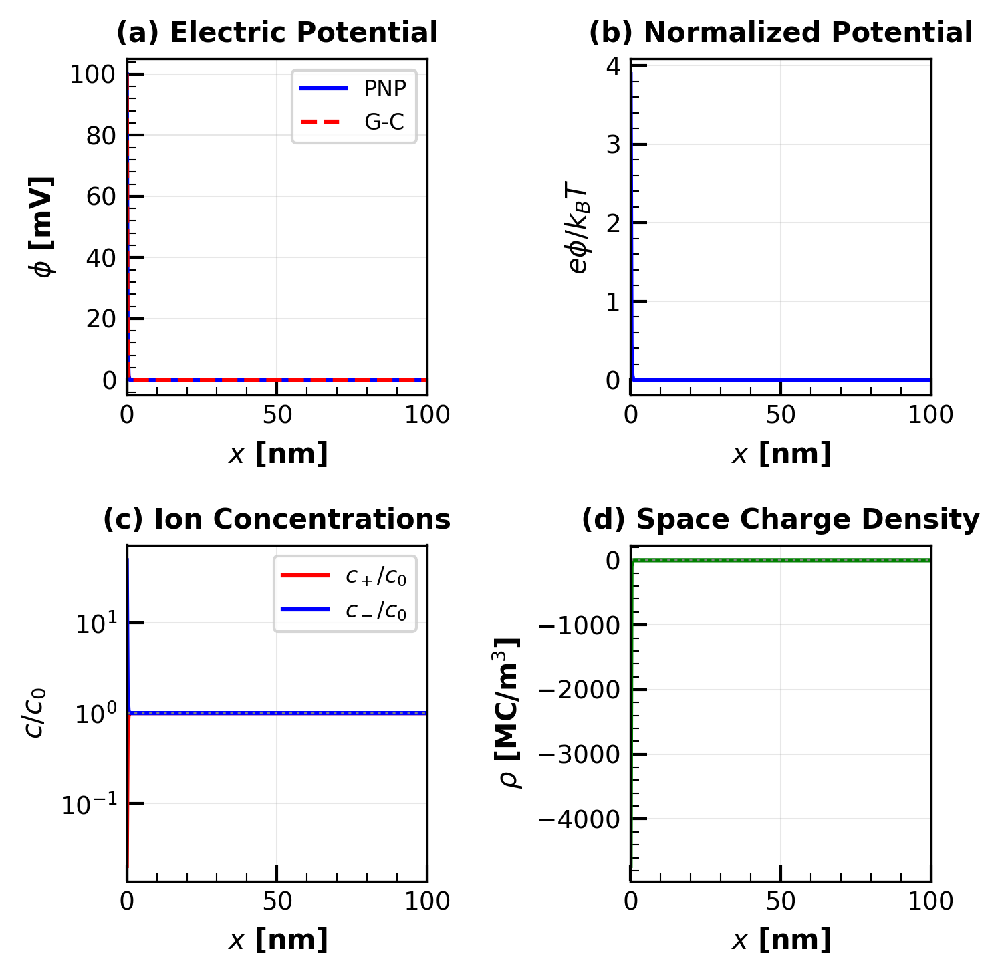
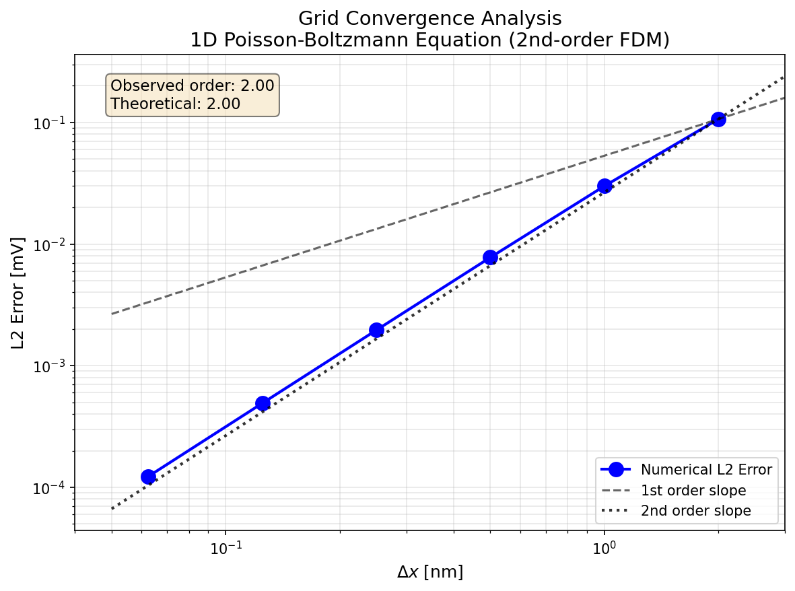
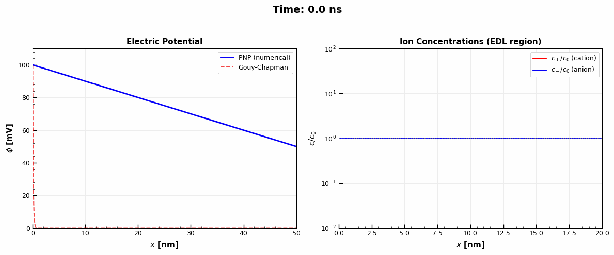

# 1D Poisson-Nernst-Planck Solver

イオン液体中の電気二重層（EDL）をシミュレーションするための C++ 数値解析ソルバー。

## 概要

Poisson-Nernst-Planck (PNP) 方程式を用いて、帯電した界面近傍のイオン分布と電位分布を計算する1次元ソルバー。

### 主な機能

- **定常解析**: Newton-Raphson法による Poisson-Boltzmann 方程式の求解
- **過渡解析**: Scharfetter-Gummel スキーム（⚠️ 開発中・不安定）
- **Bikerman モデル**: 有限イオンサイズによる立体効果
- **両電極モデル**: キャパシタ構造（closed system）のシミュレーション
- **非一様グリッド**: 界面付近にグリッドを集中配置

## クイックスタート

```bash
# ビルド
make

# 基本実行（定常解析）
./build/pnp_solver --phi0 100 --c0 1.0

# 両電極モデル（キャパシタ）
./build/pnp_solver --phi0 100 --phi-right 0 --closed-system --dual-electrode

# Bikerman モデル
./build/pnp_solver --phi0 100 --model bikerman --ion-size 0.7

# 結果の可視化
python3 scripts/plot_results.py
python3 scripts/plot_dual_electrode.py
```

## 計算結果

### 電気二重層構造

<div align="center">



*電位分布、濃度分布、空間電荷密度（c₀ = 1 M, φ₀ = 100 mV, L = 50 nm）*

</div>

### 両電極モデル（キャパシタ）

<div align="center">


*両電極構造における EDL（φ_L = 100 mV, φ_R = 0 mV, φ_bulk = 50 mV）*

</div>

### 電圧-電荷特性

<div align="center">


*印加電圧と表面電荷密度の関係。低電圧で線形、高電圧で sinh 的増加。*

</div>

### Standard PB vs Bikerman モデル

<div align="center">


*Standard PB（= Gouy-Chapman 解析解）は sinh 的に増加、Bikerman（有限イオンサイズ）は飽和。*

</div>

| 電圧 [mV] | Standard PB [μC/cm²] | Bikerman [μC/cm²] |
|:---------:|:--------------------:|:-----------------:|
| 100 | 5.1 | 4.3 |
| 200 | 15.0 | 7.7 |
| 300 | 35.4 | 10.4 |

### 格子収束性

<div align="center">



*2次精度の収束を確認（平均収束次数: 2.00）*

</div>

### 過渡解析（EDL形成過程）⚠️

<div align="center">



*100 mV ステップ応答の時間発展（0〜200 ns）— 過渡ソルバは開発中*

</div>

## コマンドラインオプション

| オプション | 説明 | デフォルト |
|-----------|------|-----------|
| `--phi0 <mV>` | 左電極電位 | 100 |
| `--phi-right <mV>` | 右電極電位 | 0 |
| `--c0 <mol/L>` | バルク濃度 | 1.0 |
| `--eps <value>` | 比誘電率 | 12 |
| `--L <nm>` | 計算領域長 | 50 |
| `--N <points>` | グリッド点数 | 1001 |
| `--stretch <factor>` | グリッドストレッチング | 3.0 |
| `--closed-system` | 両端ゼロフラックス境界条件 | off |
| `--dual-electrode` | 両電極用対称グリッド | off |
| `--model <type>` | standard / bikerman | standard |
| `--ion-size <nm>` | イオン直径（Bikerman用） | 0.7 |
| `--output <file>` | 出力ファイル名 | results/pnp_results.dat |

## 出力データ

ソルバーは以下の情報を出力：

```
# Surface charge density [uC/cm^2]:
#   Left electrode:  5.12994
#   Right electrode: -5.12994
# Capacitance [uF/cm^2]:
#   Left EDL:  102.599
#   Right EDL: 102.599
#   Total (series): 51.2994
```

データファイルのカラム:
1. x [nm]
2. x/λD [-]
3. φ [mV]
4. φ/(kT/e) [-]
5. c+ [mol/m³]
6. c- [mol/m³]
7. c+/c₀ [-]
8. c-/c₀ [-]
9. ρ [C/m³]
10. φ_GC [mV]
11. Δx [nm]

## ファイル構成

```
pnp/
├── include/pnp_solver.hpp    # クラス定義
├── src/
│   ├── pnp_solver.cpp        # ソルバー実装
│   └── main.cpp              # CLI エントリーポイント
├── scripts/
│   ├── plot_results.py       # 基本結果プロット
│   ├── plot_dual_electrode.py # 両電極モデルプロット
│   ├── plot_voltage_charge.py # 電圧-電荷特性
│   ├── plot_voltage_charge_comparison.py # PB vs Bikerman
│   ├── plot_convergence.py   # 収束性プロット
│   ├── run_convergence.sh    # 収束性テスト
│   └── create_animation.py   # GIFアニメーション
├── styles/plot_style.py      # プロットスタイル定義
├── docs/                     # 詳細ドキュメント
│   ├── theory.md            # 理論・数値解法
│   └── validation.md        # 検証結果
├── results/                  # 出力データ・図
├── CLAUDE.md                # 開発ガイドライン
└── README.md
```

## 理論背景

詳細な数学的導出は [docs/theory.md](docs/theory.md) を参照。

### 支配方程式

**Poisson 方程式**:
$$\nabla^2 \phi = -\frac{e}{\varepsilon}(z_+ c_+ + z_- c_-)$$

**Nernst-Planck 方程式**:
$$\mathbf{J}_i = -D_i \left( \nabla c_i + \frac{z_i e c_i}{k_B T} \nabla \phi \right)$$

**Poisson-Boltzmann 方程式**（定常状態）:
$$\frac{d^2 \phi}{d x^2} = \frac{2 e N_A c_0}{\varepsilon} \sinh\left( \frac{e \phi}{k_B T} \right)$$

### 特性スケール

| 量 | 定義 | 1M での値 |
|---|---|---|
| Debye 長 λD | √(εkBT / 2e²c₀NA) | 0.12 nm |
| 熱電圧 φT | kBT/e | 25.7 mV |

### Bikerman モデル

有限イオンサイズ a を考慮した修正 Boltzmann 分布:

$$c_\pm = \frac{c_0 \exp(\mp \psi)}{1 - \nu + \nu \cosh(\psi)}$$

ここで ν = 2a³c₀NA は充填率。

## 参考文献

1. Newman & Thomas-Alyea (2004). *Electrochemical Systems* (3rd ed.)
2. Bazant et al. (2009). *Adv. Colloid Interface Sci.* 152, 48-88.
3. Kilic, Bazant & Ajdari (2007). *Phys. Rev. E* 75, 021502.
4. Kornyshev (2007). *J. Phys. Chem. B* 111, 5545-5557.

## ライセンス

BSD 3-Clause License
